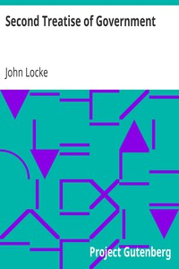

# Second Treatise of Government <kbd>7370</kbd>

## Authors

 - Locke, John <small>(1632 - 1704)</small>

## Subjects

 - Liberty -- Early works to 1800
 - Political science -- Early works to 1800
 - Toleration -- Early works to 1800

## Download

 - https://www.gutenberg.org/files/7370/7370-h.zip
 - https://www.gutenberg.org/ebooks/7370.html.images
 - https://www.gutenberg.org/cache/epub/7370/pg7370.cover.small.jpg
 - https://www.gutenberg.org/files/7370/7370-0.txt
 - https://www.gutenberg.org/ebooks/7370.kindle.images
 - https://www.gutenberg.org/ebooks/7370.rdf
 - https://www.gutenberg.org/ebooks/7370.epub.images
 - https://www.gutenberg.org/ebooks/7370.txt.utf-8

## Book Shelves

 - Philosophy
 - Politics
