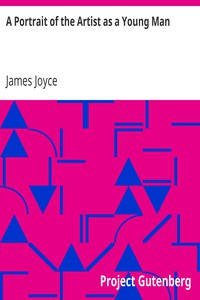

# A Portrait of the Artist as a Young Man <kbd>4217</kbd>

## Authors

 - Joyce, James <small>(1882 - 1941)</small>

## Subjects

 - Artists -- Fiction
 - Autobiographical fiction
 - Bildungsromans
 - Dublin (Ireland) -- Fiction
 - Young men -- Fiction

## Download

 - https://www.gutenberg.org/files/4217/4217-h.zip
 - https://www.gutenberg.org/cache/epub/4217/pg4217.cover.medium.jpg
 - https://www.gutenberg.org/files/4217/4217-0.txt
 - https://www.gutenberg.org/ebooks/4217.html.images
 - https://www.gutenberg.org/ebooks/4217.epub.images
 - https://www.gutenberg.org/ebooks/4217.kindle.images
 - https://www.gutenberg.org/ebooks/4217.rdf

## Book Shelves

