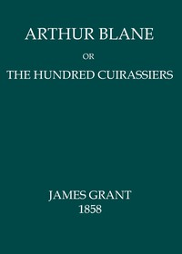

# Arthur Blane; or, The Hundred Cuirassiers <kbd>67681</kbd>

## Authors

 - Grant, James <small>(1822 - 1887)</small>

## Subjects

 - France -- History -- Louis XIII, 1610-1643 -- Fiction

## Download

 - https://www.gutenberg.org/ebooks/67681.txt.utf-8
 - https://www.gutenberg.org/ebooks/67681.kindle.images
 - https://www.gutenberg.org/ebooks/67681.rdf
 - https://www.gutenberg.org/cache/epub/67681/pg67681.cover.medium.jpg
 - https://www.gutenberg.org/ebooks/67681.epub.images
 - https://www.gutenberg.org/files/67681/67681-0.txt
 - https://www.gutenberg.org/files/67681/67681-h/67681-h.htm
 - https://www.gutenberg.org/files/67681/67681-h.zip

## Book Shelves

