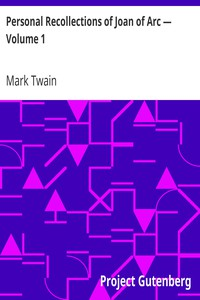

# Personal Recollections of Joan of Arc — Volume 1 <kbd>2874</kbd>

## Authors

 - Twain, Mark <small>(1835 - 1910)</small>

## Subjects

 - Biographical fiction
 - Christian women saints -- Fiction
 - France -- History -- Charles VII, 1422-1461 -- Fiction
 - Joan, of Arc, Saint, 1412-1431 -- Fiction

## Download

 - https://www.gutenberg.org/cache/epub/2874/pg2874.cover.medium.jpg
 - https://www.gutenberg.org/files/2874/2874-h.zip
 - https://www.gutenberg.org/files/2874/2874-0.zip
 - https://www.gutenberg.org/ebooks/2874.html.images
 - https://www.gutenberg.org/files/2874/2874-0.txt
 - https://www.gutenberg.org/ebooks/2874.epub.images
 - https://www.gutenberg.org/ebooks/2874.rdf
 - https://www.gutenberg.org/ebooks/2874.kindle.images

## Book Shelves

 - Historical Fiction
