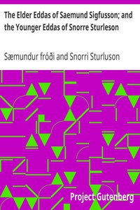

# The Elder Eddas of Saemund Sigfusson; and the Younger Eddas of Snorre Sturleson <kbd>14726</kbd>

## Authors

 - Snorri Sturluson <small>(null - 1241)</small>
 - Sæmundur fróði <small>(1056 - 1133)</small>

## Subjects

 - Mythology, Norse
 - Scalds and scaldic poetry

## Download

 - https://www.gutenberg.org/files/14726/14726-8.zip
 - https://www.gutenberg.org/files/14726/14726-8.txt
 - https://www.gutenberg.org/cache/epub/14726/pg14726.cover.medium.jpg
 - https://www.gutenberg.org/files/14726/14726-h/14726-h.htm
 - https://www.gutenberg.org/ebooks/14726.html.images
 - https://www.gutenberg.org/ebooks/14726.txt.utf-8
 - https://www.gutenberg.org/ebooks/14726.rdf
 - https://www.gutenberg.org/ebooks/14726.epub.images
 - https://www.gutenberg.org/ebooks/14726.kindle.images

## Book Shelves

