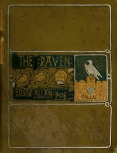

# The Works of Edgar Allan Poe, The Raven Edition: Table Of Contents And Index Of The Five Volumes <kbd>25525</kbd>

## Authors

 - Poe, Edgar Allan <small>(1809 - 1849)</small>

## Subjects

 - American fiction -- 19th century
 - Fantasy fiction
 - Horror tales, American
 - Indexes
 - Poe, Edgar Allan, 1809-1849
 - Short stories

## Download

 - https://www.gutenberg.org/files/25525/25525-h/25525-h.htm
 - https://www.gutenberg.org/files/25525/25525-0.zip
 - https://www.gutenberg.org/cache/epub/25525/pg25525.cover.medium.jpg
 - https://www.gutenberg.org/files/25525/25525-h.zip
 - https://www.gutenberg.org/ebooks/25525.txt.utf-8
 - https://www.gutenberg.org/files/25525/25525-0.txt
 - https://www.gutenberg.org/ebooks/25525.epub.images
 - https://www.gutenberg.org/ebooks/25525.rdf
 - https://www.gutenberg.org/ebooks/25525.kindle.images

## Book Shelves

