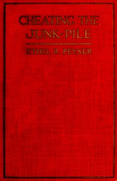

# Cheating the Junk-Pile: The Purchase and Maintenance of Household Equipments <kbd>67507</kbd>

## Authors

 - Peyser, Ethel R. (Ethel Rose) <small>(1887 - 1961)</small>

## Subjects

 - Home economics
 - Household appliances
 - Kitchen appliances
 - Kitchen utensils

## Download

 - https://www.gutenberg.org/ebooks/67507.html.images
 - https://www.gutenberg.org/files/67507/67507-0.zip
 - https://www.gutenberg.org/ebooks/67507.rdf
 - https://www.gutenberg.org/cache/epub/67507/pg67507.cover.small.jpg
 - https://www.gutenberg.org/ebooks/67507.epub.images
 - https://www.gutenberg.org/ebooks/67507.txt.utf-8
 - https://www.gutenberg.org/ebooks/67507.kindle.images
 - https://www.gutenberg.org/files/67507/67507-0.txt

## Book Shelves

