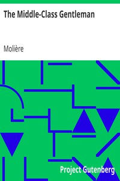

# The Middle-Class Gentleman <kbd>2992</kbd>

## Authors

 - Molière <small>(1622 - 1673)</small>

## Subjects

 - Comedies
 - France -- Social life and customs -- 17th century -- Drama
 - French drama
 - Middle class -- France -- Drama

## Download

 - https://www.gutenberg.org/files/2992/2992.txt
 - https://www.gutenberg.org/files/2992/2992.zip
 - https://www.gutenberg.org/cache/epub/2992/pg2992.cover.medium.jpg
 - https://www.gutenberg.org/files/2992/2992-h/2992-h.htm
 - https://www.gutenberg.org/ebooks/2992.html.images
 - https://www.gutenberg.org/ebooks/2992.rdf
 - https://www.gutenberg.org/ebooks/2992.epub.images
 - https://www.gutenberg.org/ebooks/2992.kindle.images
 - https://www.gutenberg.org/ebooks/2992.txt.utf-8

## Book Shelves

