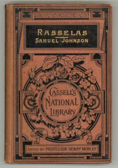

# Rasselas, Prince of Abyssinia <kbd>652</kbd>

## Authors

 - Johnson, Samuel <small>(1709 - 1784)</small>

## Subjects

 - Ethiopia -- Fiction
 - Happiness -- Fiction
 - Princes -- Fiction
 - Satire

## Download

 - https://www.gutenberg.org/files/652/652-0.zip
 - https://www.gutenberg.org/cache/epub/652/pg652.cover.medium.jpg
 - https://www.gutenberg.org/files/652/652-h/652-h.htm
 - https://www.gutenberg.org/files/652/652-0.txt
 - https://www.gutenberg.org/ebooks/652.kindle.images
 - https://www.gutenberg.org/ebooks/652.rdf
 - https://www.gutenberg.org/ebooks/652.epub.images

## Book Shelves

 - Best Books Ever Listings
