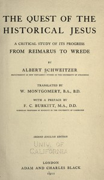

# The Quest of the Historical Jesus: A Critical Study of its Progress from Reimarus to Wrede <kbd>45422</kbd>

## Authors

 - Schweitzer, Albert <small>(1875 - 1965)</small>

## Subjects

 - Jesus Christ -- Biography -- History and criticism
 - Jesus Christ -- Historicity

## Download

 - https://www.gutenberg.org/files/45422/45422-tei.zip
 - https://www.gutenberg.org/files/45422/45422-0.zip
 - https://www.gutenberg.org/files/45422/45422-8.zip
 - https://www.gutenberg.org/files/45422/45422-0.txt
 - https://www.gutenberg.org/cache/epub/45422/pg45422.cover.small.jpg
 - https://www.gutenberg.org/files/45422/45422.txt
 - https://www.gutenberg.org/ebooks/45422.html.images
 - https://www.gutenberg.org/files/45422/45422-h/45422-h.html
 - https://www.gutenberg.org/files/45422/45422-pdf.pdf
 - https://www.gutenberg.org/files/45422/45422-tei/45422-tei.tei
 - https://www.gutenberg.org/ebooks/45422.epub.images
 - https://www.gutenberg.org/ebooks/45422.kindle.images
 - https://www.gutenberg.org/ebooks/45422.rdf

## Book Shelves

