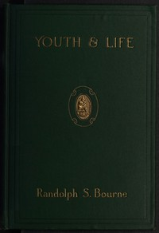

# Youth and Life <kbd>67628</kbd>

## Authors

 - Bourne, Randolph Silliman <small>(1886 - 1918)</small>

## Subjects

 - American essays -- 20th century

## Download

 - https://www.gutenberg.org/ebooks/67628.rdf
 - https://www.gutenberg.org/ebooks/67628.txt.utf-8
 - https://www.gutenberg.org/files/67628/67628-h.zip
 - https://www.gutenberg.org/ebooks/67628.kindle.images
 - https://www.gutenberg.org/files/67628/67628-0.zip
 - https://www.gutenberg.org/cache/epub/67628/pg67628.cover.small.jpg
 - https://www.gutenberg.org/ebooks/67628.epub.images
 - https://www.gutenberg.org/files/67628/67628-h/67628-h.htm
 - https://www.gutenberg.org/files/67628/67628-0.txt

## Book Shelves

