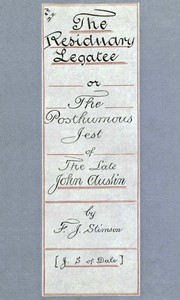

# The Residuary Legatee; Or, The Posthumous Jest of the Late John Austin <kbd>67592</kbd>

## Authors

 - Stimson, Frederic Jesup <small>(1855 - 1943)</small>

## Subjects

 - Inheritance and succession -- Fiction

## Download

 - https://www.gutenberg.org/ebooks/67592.rdf
 - https://www.gutenberg.org/ebooks/67592.txt.utf-8
 - https://www.gutenberg.org/cache/epub/67592/pg67592.cover.medium.jpg
 - https://www.gutenberg.org/ebooks/67592.epub.images
 - https://www.gutenberg.org/files/67592/67592-h.zip
 - https://www.gutenberg.org/ebooks/67592.kindle.images
 - https://www.gutenberg.org/files/67592/67592-0.txt
 - https://www.gutenberg.org/files/67592/67592-h/67592-h.htm

## Book Shelves

