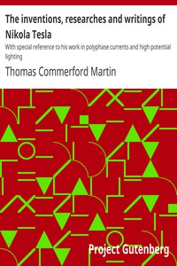

# The inventions, researches and writings of Nikola Tesla: With special reference to his work in polyphase currents and high potential lighting <kbd>39272</kbd>

## Authors

 - Martin, Thomas Commerford <small>(1856 - 1924)</small>

## Subjects

 - Electric currents, Alternating
 - Electrical engineering

## Download

 - https://www.gutenberg.org/files/39272/39272.txt
 - https://www.gutenberg.org/files/39272/39272-h.zip
 - https://www.gutenberg.org/files/39272/39272-8.txt
 - https://www.gutenberg.org/cache/epub/39272/pg39272.cover.medium.jpg
 - https://www.gutenberg.org/ebooks/39272.html.images
 - https://www.gutenberg.org/files/39272/39272-h/39272-h.htm
 - https://www.gutenberg.org/ebooks/39272.txt.utf-8
 - https://www.gutenberg.org/ebooks/39272.rdf
 - https://www.gutenberg.org/ebooks/39272.kindle.images
 - https://www.gutenberg.org/ebooks/39272.epub.images

## Book Shelves

