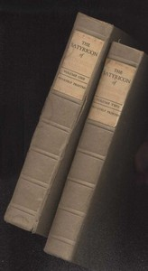

# The Satyricon — Complete <kbd>5225</kbd>

## Authors

 - Petronius Arbiter <small>(20 - 66)</small>

## Subjects

 - Rome -- Fiction
 - Satire, Latin -- Translations into English

## Download

 - https://www.gutenberg.org/cache/epub/5225/pg5225.cover.small.jpg
 - https://www.gutenberg.org/files/5225/5225.txt
 - https://www.gutenberg.org/files/5225/5225-h/5225-h.htm
 - https://www.gutenberg.org/files/5225/5225-0.txt
 - https://www.gutenberg.org/files/5225/5225-0.zip
 - https://www.gutenberg.org/ebooks/5225.html.images
 - https://www.gutenberg.org/ebooks/5225.kindle.images
 - https://www.gutenberg.org/ebooks/5225.rdf
 - https://www.gutenberg.org/ebooks/5225.epub.images

## Book Shelves

 - Banned Books from Anne Haight's list
 - Erotic Fiction
