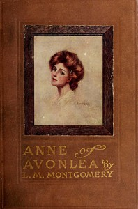

# Anne of Avonlea <kbd>47</kbd>

## Authors

 - Montgomery, L. M. (Lucy Maud) <small>(1874 - 1942)</small>

## Subjects

 - Canada -- History -- 1914-1945 -- Fiction
 - Islands -- Fiction
 - Orphans -- Fiction
 - Prince Edward Island -- History -- 20th century -- Fiction
 - Shirley, Anne (Fictitious character) -- Fiction
 - Teachers -- Fiction

## Download

 - https://www.gutenberg.org/files/47/47-h/47-h.htm
 - https://www.gutenberg.org/cache/epub/47/pg47.cover.medium.jpg
 - https://www.gutenberg.org/files/47/47-h.zip
 - https://www.gutenberg.org/ebooks/47.txt.utf-8
 - https://www.gutenberg.org/files/47/47-0.txt
 - https://www.gutenberg.org/ebooks/47.kindle.images
 - https://www.gutenberg.org/ebooks/47.rdf
 - https://www.gutenberg.org/ebooks/47.epub.images

## Book Shelves

 - Canada
 - Children's Literature
