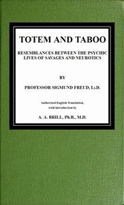

# Totem and Taboo: Resemblances Between the Psychic Lives of Savages and Neurotics <kbd>41214</kbd>

## Authors

 - Freud, Sigmund <small>(1856 - 1939)</small>

## Subjects

 - Ethnopsychology
 - Neuroses
 - Psychoanalysis
 - Taboo
 - Totemism

## Download

 - https://www.gutenberg.org/files/41214/41214-8.txt
 - https://www.gutenberg.org/cache/epub/41214/pg41214.cover.medium.jpg
 - https://www.gutenberg.org/files/41214/41214-h.zip
 - https://www.gutenberg.org/files/41214/41214-0.txt
 - https://www.gutenberg.org/files/41214/41214.txt
 - https://www.gutenberg.org/ebooks/41214.html.images
 - https://www.gutenberg.org/files/41214/41214-h/41214-h.htm
 - https://www.gutenberg.org/ebooks/41214.kindle.images
 - https://www.gutenberg.org/ebooks/41214.rdf
 - https://www.gutenberg.org/ebooks/41214.epub.images

## Book Shelves

