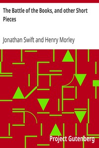

# The Battle of the Books, and other Short Pieces <kbd>623</kbd>

## Authors

 - Swift, Jonathan <small>(1667 - 1745)</small>

## Subjects

 - Ancients and moderns, Quarrel of
 - English essays
 - Satire, English

## Download

 - https://www.gutenberg.org/cache/epub/623/pg623.cover.small.jpg
 - https://www.gutenberg.org/files/623/623.zip
 - https://www.gutenberg.org/files/623/623-h.zip
 - https://www.gutenberg.org/files/623/623.txt
 - https://www.gutenberg.org/ebooks/623.kindle.images
 - https://www.gutenberg.org/ebooks/623.txt.utf-8
 - https://www.gutenberg.org/ebooks/623.rdf
 - https://www.gutenberg.org/ebooks/623.epub.images

## Book Shelves

