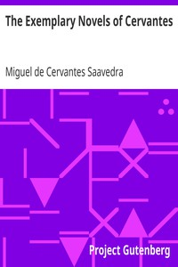

# The Exemplary Novels of Cervantes <kbd>14420</kbd>

## Authors

 - Cervantes Saavedra, Miguel de <small>(1547 - 1616)</small>

## Subjects

 - Spanish fiction -- Translations into English

## Download

 - https://www.gutenberg.org/files/14420/14420-h.zip
 - https://www.gutenberg.org/cache/epub/14420/pg14420.cover.small.jpg
 - https://www.gutenberg.org/files/14420/14420-h/14420-h.htm
 - https://www.gutenberg.org/files/14420/14420.txt
 - https://www.gutenberg.org/ebooks/14420.html.images
 - https://www.gutenberg.org/files/14420/14420-8.txt
 - https://www.gutenberg.org/ebooks/14420.txt.utf-8
 - https://www.gutenberg.org/ebooks/14420.epub.images
 - https://www.gutenberg.org/ebooks/14420.kindle.images
 - https://www.gutenberg.org/ebooks/14420.rdf

## Book Shelves

