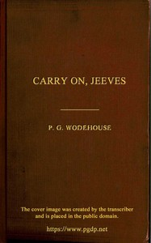

# Carry On, Jeeves <kbd>65974</kbd>

## Authors

 - Wodehouse, P. G. (Pelham Grenville) <small>(1881 - 1975)</small>

## Subjects

 - British -- New York (State) -- New York -- Fiction
 - England -- Fiction
 - Humorous stories
 - Jeeves (Fictitious character) -- Fiction
 - Short stories
 - Single men -- Fiction
 - Valets -- Fiction
 - Wooster, Bertie (Fictitious character) -- Fiction

## Download

 - https://www.gutenberg.org/files/65974/65974-0.zip
 - https://www.gutenberg.org/files/65974/65974-h/65974-h.htm
 - https://www.gutenberg.org/files/65974/65974-h.zip
 - https://www.gutenberg.org/cache/epub/65974/pg65974.cover.medium.jpg
 - https://www.gutenberg.org/ebooks/65974.html.images
 - https://www.gutenberg.org/ebooks/65974.epub.images
 - https://www.gutenberg.org/ebooks/65974.rdf
 - https://www.gutenberg.org/ebooks/65974.kindle.images

## Book Shelves

