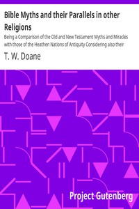

# Bible Myths and their Parallels in other Religions: Being a Comparison of the Old and New Testament Myths and Miracles with those of the Heathen Nations of Antiquity Considering also their Origin and Meaning <kbd>31885</kbd>

## Authors

 - Doane, T. W. (Thomas William) <small>(1852 - 1885)</small>

## Subjects

 - Bible -- Criticism, interpretation, etc.
 - Mythology

## Download

 - https://www.gutenberg.org/files/31885/31885-0.zip
 - https://www.gutenberg.org/files/31885/31885.zip
 - https://www.gutenberg.org/files/31885/31885-h/31885-h.htm
 - https://www.gutenberg.org/cache/epub/31885/pg31885.cover.medium.jpg
 - https://www.gutenberg.org/files/31885/31885.txt
 - https://www.gutenberg.org/files/31885/31885-8.txt
 - https://www.gutenberg.org/ebooks/31885.html.images
 - https://www.gutenberg.org/ebooks/31885.epub.images
 - https://www.gutenberg.org/ebooks/31885.rdf
 - https://www.gutenberg.org/ebooks/31885.kindle.images

## Book Shelves

