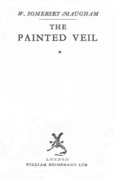

# The Painted Veil <kbd>64682</kbd>

## Authors

 - Maugham, W. Somerset (William Somerset) <small>(1874 - 1965)</small>

## Subjects

 - Adultery -- Fiction
 - Bacteriologists -- Fiction
 - British -- China -- Fiction
 - China -- Fiction
 - Cholera -- Fiction
 - Domestic fiction
 - Married people -- Fiction
 - Psychological fiction

## Download

 - https://www.gutenberg.org/ebooks/64682.html.images
 - https://www.gutenberg.org/files/64682/64682-0.zip
 - https://www.gutenberg.org/files/64682/64682-h.zip
 - https://www.gutenberg.org/cache/epub/64682/pg64682.cover.small.jpg
 - https://www.gutenberg.org/ebooks/64682.txt.utf-8
 - https://www.gutenberg.org/files/64682/64682-0.txt
 - https://www.gutenberg.org/ebooks/64682.epub.images
 - https://www.gutenberg.org/ebooks/64682.kindle.images
 - https://www.gutenberg.org/ebooks/64682.rdf

## Book Shelves

