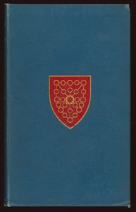

# The Tales of the Heptameron, Vol. 2 (of 5) <kbd>17702</kbd>

## Authors

 - Marguerite, Queen, consort of Henry II, King of Navarre <small>(1492 - 1549)</small>

## Subjects

 - Love stories, French -- Translations into English
 - Tales -- France -- Translations into English

## Download

 - https://www.gutenberg.org/files/17702/17702.zip
 - https://www.gutenberg.org/files/17702/17702.txt
 - https://www.gutenberg.org/files/17702/17702-8.txt
 - https://www.gutenberg.org/cache/epub/17702/pg17702.cover.medium.jpg
 - https://www.gutenberg.org/files/17702/17702-0.txt
 - https://www.gutenberg.org/files/17702/17702-h/17702-h.htm
 - https://www.gutenberg.org/ebooks/17702.html.images
 - https://www.gutenberg.org/ebooks/17702.epub.images
 - https://www.gutenberg.org/ebooks/17702.kindle.images
 - https://www.gutenberg.org/ebooks/17702.rdf

## Book Shelves

