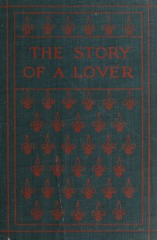

# The Story of a Lover <kbd>67706</kbd>

## Authors

 - Hapgood, Hutchins <small>(1869 - 1944)</small>

## Subjects

 - Love
 - Open marriage

## Download

 - https://www.gutenberg.org/files/67706/67706-0.zip
 - https://www.gutenberg.org/ebooks/67706.rdf
 - https://www.gutenberg.org/ebooks/67706.kindle.images
 - https://www.gutenberg.org/files/67706/67706-h.zip
 - https://www.gutenberg.org/ebooks/67706.txt.utf-8
 - https://www.gutenberg.org/cache/epub/67706/pg67706.cover.medium.jpg
 - https://www.gutenberg.org/ebooks/67706.epub.images
 - https://www.gutenberg.org/files/67706/67706-0.txt
 - https://www.gutenberg.org/files/67706/67706-h/67706-h.htm

## Book Shelves

