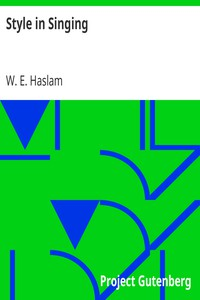

# Style in Singing <kbd>21400</kbd>

## Authors

 - Haslam, W. E. <small>(null - null)</small>

## Subjects

 - Singing
 - Voice culture

## Download

 - https://www.gutenberg.org/files/21400/21400-h/21400-h.htm
 - https://www.gutenberg.org/cache/epub/21400/pg21400.cover.small.jpg
 - https://www.gutenberg.org/files/21400/21400-h/music/music28.midi
 - https://www.gutenberg.org/files/21400/21400.txt
 - https://www.gutenberg.org/files/21400/21400-8.txt
 - https://www.gutenberg.org/ebooks/21400.html.images
 - https://www.gutenberg.org/ebooks/21400.txt.utf-8
 - https://www.gutenberg.org/ebooks/21400.epub.images
 - https://www.gutenberg.org/ebooks/21400.rdf
 - https://www.gutenberg.org/ebooks/21400.kindle.images

## Book Shelves

 - Music
