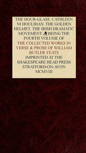

# The Collected Works in Verse and Prose of William Butler Yeats, Vol. 4 (of 8): The Hour-glass. Cathleen ni Houlihan. The Golden Helmet. The Irish Dramatic Movement <kbd>49611</kbd>

## Authors

 - Yeats, W. B. (William Butler) <small>(1865 - 1939)</small>

## Subjects

 - English literature -- Irish authors

## Download

 - https://www.gutenberg.org/cache/epub/49611/pg49611.cover.medium.jpg
 - https://www.gutenberg.org/files/49611/49611-0.txt
 - https://www.gutenberg.org/files/49611/49611-0.zip
 - https://www.gutenberg.org/files/49611/49611-h/49611-h.htm
 - https://www.gutenberg.org/ebooks/49611.html.images
 - https://www.gutenberg.org/ebooks/49611.rdf
 - https://www.gutenberg.org/ebooks/49611.epub.images
 - https://www.gutenberg.org/ebooks/49611.kindle.images

## Book Shelves

