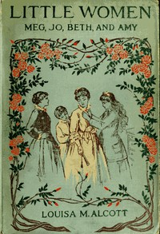

# Little Women; Or, Meg, Jo, Beth, and Amy <kbd>37106</kbd>

## Authors

 - Alcott, Louisa May <small>(1832 - 1888)</small>

## Subjects

 - Autobiographical fiction
 - Bildungsromans
 - Domestic fiction
 - Family life -- New England -- Fiction
 - March family (Fictitious characters) -- Fiction
 - Mothers and daughters -- Fiction
 - New England -- Fiction
 - Sisters -- Fiction
 - Young women -- Fiction

## Download

 - https://www.gutenberg.org/cache/epub/37106/pg37106.cover.medium.jpg
 - https://www.gutenberg.org/files/37106/37106.zip
 - https://www.gutenberg.org/files/37106/37106-h.zip
 - https://www.gutenberg.org/files/37106/37106-h/37106-h.htm
 - https://www.gutenberg.org/ebooks/37106.html.images
 - https://www.gutenberg.org/ebooks/37106.rdf
 - https://www.gutenberg.org/ebooks/37106.epub.images
 - https://www.gutenberg.org/ebooks/37106.kindle.images
 - https://www.gutenberg.org/ebooks/37106.txt.utf-8

## Book Shelves

