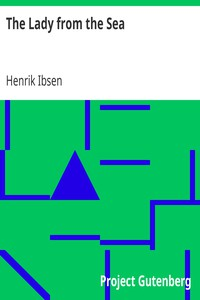

# The Lady from the Sea <kbd>2765</kbd>

## Authors

 - Ibsen, Henrik <small>(1828 - 1906)</small>

## Subjects

 - Family secrets -- Drama
 - Man-woman relationships -- Drama
 - Married people -- Drama
 - Norwegian drama -- Translations into English

## Download

 - https://www.gutenberg.org/cache/epub/2765/pg2765.cover.small.jpg
 - https://www.gutenberg.org/files/2765/2765.zip
 - https://www.gutenberg.org/files/2765/2765-h/2765-h.htm
 - https://www.gutenberg.org/ebooks/2765.html.images
 - https://www.gutenberg.org/ebooks/2765.rdf
 - https://www.gutenberg.org/ebooks/2765.epub.images
 - https://www.gutenberg.org/ebooks/2765.kindle.images
 - https://www.gutenberg.org/files/2765/2765.txt
 - https://www.gutenberg.org/ebooks/2765.txt.utf-8

## Book Shelves

