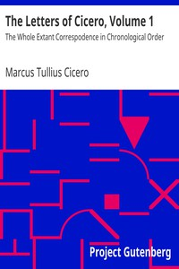

# The Letters of Cicero, Volume 1: The Whole Extant Correspodence in Chronological Order <kbd>21200</kbd>

## Authors

 - Cicero, Marcus Tullius <small>(-106 - -43)</small>

## Subjects

 - Authors, Latin -- Correspondence
 - Cicero, Marcus Tullius -- Correspondence
 - Statesmen -- Rome -- Correspondence

## Download

 - https://www.gutenberg.org/files/21200/21200-0.txt
 - https://www.gutenberg.org/files/21200/21200-h.zip
 - https://www.gutenberg.org/cache/epub/21200/pg21200.cover.medium.jpg
 - https://www.gutenberg.org/files/21200/21200-h/21200-h.htm
 - https://www.gutenberg.org/files/21200/21200.txt
 - https://www.gutenberg.org/ebooks/21200.html.images
 - https://www.gutenberg.org/files/21200/21200-8.txt
 - https://www.gutenberg.org/ebooks/21200.epub.images
 - https://www.gutenberg.org/ebooks/21200.rdf
 - https://www.gutenberg.org/ebooks/21200.kindle.images

## Book Shelves

 - Classical Antiquity
 - Harvard Classics
