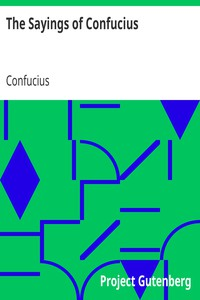

# The Sayings of Confucius <kbd>24055</kbd>

## Authors

 - Confucius <small>(-551 - -479)</small>

## Subjects

 - Confucianism
 - Philosophy, Chinese

## Download

 - https://www.gutenberg.org/files/24055/24055-h.zip
 - https://www.gutenberg.org/files/24055/24055.txt
 - https://www.gutenberg.org/ebooks/24055.html.images
 - https://www.gutenberg.org/cache/epub/24055/pg24055.cover.small.jpg
 - https://www.gutenberg.org/files/24055/24055-h/24055-h.htm
 - https://www.gutenberg.org/files/24055/24055-8.txt
 - https://www.gutenberg.org/ebooks/24055.txt.utf-8
 - https://www.gutenberg.org/ebooks/24055.kindle.images
 - https://www.gutenberg.org/ebooks/24055.epub.images
 - https://www.gutenberg.org/ebooks/24055.rdf

## Book Shelves

