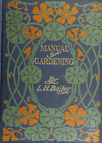

# Manual of Gardening (Second Edition): A Practical Guide to the Making of Home Grounds and the Growing of Flowers, Fruits, and Vegetables for Home Use <kbd>9550</kbd>

## Authors

 - Bailey, L. H. (Liberty Hyde) <small>(1858 - 1954)</small>

## Subjects

 - Gardening

## Download

 - https://www.gutenberg.org/files/9550/9550-h/9550-h.htm
 - https://www.gutenberg.org/files/9550/9550-h.zip
 - https://www.gutenberg.org/files/9550/9550-0.txt
 - https://www.gutenberg.org/cache/epub/9550/pg9550.cover.medium.jpg
 - https://www.gutenberg.org/ebooks/9550.html.images
 - https://www.gutenberg.org/ebooks/9550.epub.images
 - https://www.gutenberg.org/ebooks/9550.kindle.images
 - https://www.gutenberg.org/ebooks/9550.rdf

## Book Shelves

 - Horticulture
