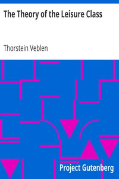

# The Theory of the Leisure Class <kbd>833</kbd>

## Authors

 - Veblen, Thorstein <small>(1857 - 1929)</small>

## Subjects

 - Leisure class
 - Sociology

## Download

 - https://www.gutenberg.org/files/833/833-8.txt
 - https://www.gutenberg.org/files/833/833-h.zip
 - https://www.gutenberg.org/cache/epub/833/pg833.cover.small.jpg
 - https://www.gutenberg.org/files/833/833.txt
 - https://www.gutenberg.org/files/833/833-h/833-h.htm
 - https://www.gutenberg.org/ebooks/833.html.images
 - https://www.gutenberg.org/ebooks/833.kindle.images
 - https://www.gutenberg.org/ebooks/833.txt.utf-8
 - https://www.gutenberg.org/ebooks/833.rdf
 - https://www.gutenberg.org/ebooks/833.epub.images

## Book Shelves

