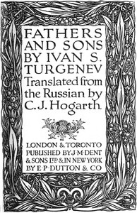

# Fathers and Sons <kbd>47935</kbd>

## Authors

 - Turgenev, Ivan Sergeevich <small>(1818 - 1883)</small>

## Subjects

 - Domestic fiction
 - Fathers and sons -- Fiction
 - Historical fiction
 - Nihilism (Philosophy) -- Fiction
 - Russia -- Social conditions -- 1801-1917 -- Fiction
 - Russia -- Social life and customs -- 1533-1917 -- Fiction

## Download

 - https://www.gutenberg.org/files/47935/47935-h.zip
 - https://www.gutenberg.org/cache/epub/47935/pg47935.cover.medium.jpg
 - https://www.gutenberg.org/files/47935/47935-8.txt
 - https://www.gutenberg.org/ebooks/47935.html.images
 - https://www.gutenberg.org/files/47935/47935-h/47935-h.htm
 - https://www.gutenberg.org/ebooks/47935.epub.images
 - https://www.gutenberg.org/ebooks/47935.rdf
 - https://www.gutenberg.org/ebooks/47935.txt.utf-8
 - https://www.gutenberg.org/ebooks/47935.kindle.images

## Book Shelves

