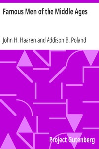

# Famous Men of the Middle Ages <kbd>3725</kbd>

## Authors

 - Haaren, John H. (John Henry) <small>(1855 - 1916)</small>
 - Poland, Addison B. <small>(null - null)</small>

## Subjects

 - Europe -- Biography
 - Europe -- History -- 476-1492

## Download

 - https://www.gutenberg.org/files/3725/3725-h/3725-h.htm
 - https://www.gutenberg.org/cache/epub/3725/pg3725.cover.medium.jpg
 - https://www.gutenberg.org/files/3725/3725.zip
 - https://www.gutenberg.org/files/3725/3725.txt
 - https://www.gutenberg.org/ebooks/3725.html.images
 - https://www.gutenberg.org/files/3725/3725-8.txt
 - https://www.gutenberg.org/ebooks/3725.kindle.images
 - https://www.gutenberg.org/ebooks/3725.txt.utf-8
 - https://www.gutenberg.org/ebooks/3725.rdf
 - https://www.gutenberg.org/ebooks/3725.epub.images

## Book Shelves

 - Biographies
