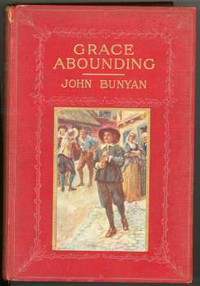

# Grace Abounding to the Chief of Sinners <kbd>654</kbd>

## Authors

 - Bunyan, John <small>(1628 - 1688)</small>

## Subjects

 - Authors, English -- Early modern, 1500-1700 -- Biography
 - Bunyan, John, 1628-1688
 - Christian biography -- England
 - Puritans -- England -- Biography

## Download

 - https://www.gutenberg.org/files/654/654-0.txt
 - https://www.gutenberg.org/files/654/654-h.zip
 - https://www.gutenberg.org/files/654/654-0.zip
 - https://www.gutenberg.org/cache/epub/654/pg654.cover.medium.jpg
 - https://www.gutenberg.org/ebooks/654.kindle.images
 - https://www.gutenberg.org/ebooks/654.rdf
 - https://www.gutenberg.org/ebooks/654.epub.images

## Book Shelves

 - Christianity
