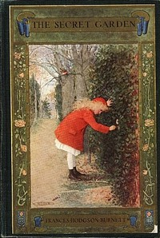

# The Secret Garden <kbd>17396</kbd>

## Authors

 - Burnett, Frances Hodgson <small>(1849 - 1924)</small>

## Subjects

 - Gardens -- Juvenile fiction
 - Orphans -- Juvenile fiction
 - People with disabilities -- Juvenile fiction
 - Yorkshire (England) -- Juvenile fiction

## Download

 - https://www.gutenberg.org/files/17396/17396.txt
 - https://www.gutenberg.org/files/17396/17396-8.txt
 - https://www.gutenberg.org/files/17396/17396-h.zip
 - https://www.gutenberg.org/cache/epub/17396/pg17396.cover.medium.jpg
 - https://www.gutenberg.org/ebooks/17396.html.images
 - https://www.gutenberg.org/files/17396/17396-h/17396-h.htm
 - https://www.gutenberg.org/ebooks/17396.kindle.images
 - https://www.gutenberg.org/ebooks/17396.txt.utf-8
 - https://www.gutenberg.org/ebooks/17396.epub.images
 - https://www.gutenberg.org/ebooks/17396.rdf

## Book Shelves

 - Children's Literature
