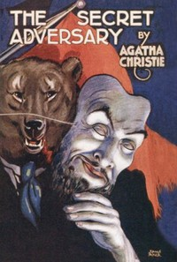

# The Secret Adversary <kbd>1155</kbd>

## Authors

 - Christie, Agatha <small>(1890 - 1976)</small>

## Subjects

 - Beresford, Tommy (Fictitious character) -- Fiction
 - Beresford, Tuppence (Fictitious character) -- Fiction
 - Detective and mystery stories
 - Domestic fiction
 - Married people -- Fiction
 - Missing persons -- Fiction
 - Private investigators -- England -- Fiction

## Download

 - https://www.gutenberg.org/files/1155/1155-h/1155-h.htm
 - https://www.gutenberg.org/files/1155/1155-h.zip
 - https://www.gutenberg.org/files/1155/1155-0.zip
 - https://www.gutenberg.org/cache/epub/1155/pg1155.cover.small.jpg
 - https://www.gutenberg.org/ebooks/1155.html.images
 - https://www.gutenberg.org/ebooks/1155.epub.images
 - https://www.gutenberg.org/ebooks/1155.rdf
 - https://www.gutenberg.org/ebooks/1155.kindle.images

## Book Shelves

 - Detective Fiction
