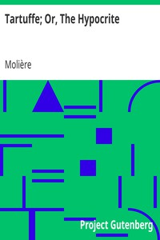

# Tartuffe; Or, The Hypocrite <kbd>2027</kbd>

## Authors

 - Molière <small>(1622 - 1673)</small>

## Subjects

 - Comedies
 - French drama -- 17th century -- Translations into English

## Download

 - https://www.gutenberg.org/cache/epub/2027/pg2027.cover.medium.jpg
 - https://www.gutenberg.org/files/2027/2027.zip
 - https://www.gutenberg.org/ebooks/2027.kindle.images
 - https://www.gutenberg.org/ebooks/2027.txt.utf-8
 - https://www.gutenberg.org/ebooks/2027.html.images
 - https://www.gutenberg.org/ebooks/2027.rdf
 - https://www.gutenberg.org/ebooks/2027.epub.images

## Book Shelves

 - Harvard Classics
