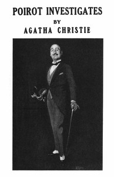

# Poirot Investigates <kbd>61262</kbd>

## Authors

 - Christie, Agatha <small>(1890 - 1976)</small>

## Subjects

 - Belgians -- England -- Fiction
 - Detective and mystery stories, English
 - Poirot, Hercule (Fictitious character) -- Fiction
 - Private investigators -- England -- Fiction

## Download

 - https://www.gutenberg.org/cache/epub/61262/pg61262.cover.small.jpg
 - https://www.gutenberg.org/files/61262/61262-h.zip
 - https://www.gutenberg.org/files/61262/61262-h/61262-h.htm
 - https://www.gutenberg.org/ebooks/61262.html.images
 - https://www.gutenberg.org/files/61262/61262-0.txt
 - https://www.gutenberg.org/ebooks/61262.rdf
 - https://www.gutenberg.org/ebooks/61262.kindle.images
 - https://www.gutenberg.org/ebooks/61262.epub.images

## Book Shelves

 - Detective Fiction
