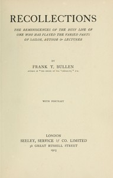

# Recollections: The Reminiscences of the Busy Life of One Who Has Played the Varied Parts of Sailor, Author & Lecturer <kbd>67673</kbd>

## Authors

 - Bullen, Frank Thomas <small>(1857 - 1915)</small>

## Subjects

 - Authors, English -- 20th century -- Biography
 - Bullen, Frank Thomas, 1857-1915
 - Lecturers -- Great Britain -- Biography

## Download

 - https://www.gutenberg.org/ebooks/67673.rdf
 - https://www.gutenberg.org/ebooks/67673.epub.images
 - https://www.gutenberg.org/ebooks/67673.kindle.images
 - https://www.gutenberg.org/ebooks/67673.txt.utf-8
 - https://www.gutenberg.org/cache/epub/67673/pg67673.cover.medium.jpg
 - https://www.gutenberg.org/ebooks/67673.html.images
 - https://www.gutenberg.org/files/67673/67673-0.zip
 - https://www.gutenberg.org/files/67673/67673-0.txt

## Book Shelves

