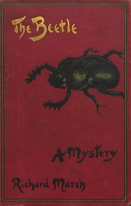

# The Beetle: A Mystery <kbd>5164</kbd>

## Authors

 - Marsh, Richard <small>(1857 - 1915)</small>

## Subjects

 - British -- Egypt -- Fiction
 - Champnell, Augustus (Fictitious character) -- Fiction
 - Egypt -- Antiquities -- Collection and preservation -- Fiction
 - Egyptologists -- Fiction
 - Horror tales
 - London (England) -- Fiction
 - Monsters -- Fiction
 - Paranormal fiction
 - Politicians -- Fiction
 - Revenge -- Fiction

## Download

 - https://www.gutenberg.org/files/5164/5164-0.zip
 - https://www.gutenberg.org/files/5164/5164-h.zip
 - https://www.gutenberg.org/cache/epub/5164/pg5164.cover.small.jpg
 - https://www.gutenberg.org/files/5164/5164-h/5164-h.htm
 - https://www.gutenberg.org/ebooks/5164.kindle.images
 - https://www.gutenberg.org/ebooks/5164.rdf
 - https://www.gutenberg.org/ebooks/5164.epub.images

## Book Shelves

 - Mystery Fiction
