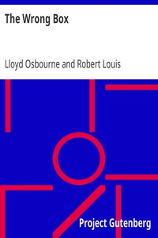

# The Wrong Box <kbd>1585</kbd>

## Authors

 - Stevenson, Robert Louis <small>(1850 - 1894)</small>
 - Osbourne, Lloyd <small>(1868 - 1947)</small>

## Subjects

 - Avarice -- Fiction
 - Brothers -- Fiction
 - Cousins -- Fiction
 - Inheritance and succession -- Fiction
 - Mystery fiction
 - Uncles -- Fiction

## Download

 - https://www.gutenberg.org/files/1585/1585-h/1585-h.htm
 - https://www.gutenberg.org/files/1585/1585.zip
 - https://www.gutenberg.org/cache/epub/1585/pg1585.cover.medium.jpg
 - https://www.gutenberg.org/files/1585/1585-0.txt
 - https://www.gutenberg.org/files/1585/1585.txt
 - https://www.gutenberg.org/ebooks/1585.html.images
 - https://www.gutenberg.org/ebooks/1585.epub.images
 - https://www.gutenberg.org/ebooks/1585.rdf
 - https://www.gutenberg.org/ebooks/1585.kindle.images

## Book Shelves

