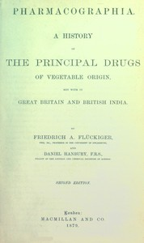

# Pharmacographia: A history of the principal drugs of vegetable origin, met with in Great Britain and British India <kbd>67691</kbd>

## Authors

 - Hanbury, Daniel <small>(1825 - 1875)</small>
 - Flückiger, Friedrich A. (Friedrich August) <small>(1828 - 1894)</small>

## Subjects

 - Botany, Medical
 - Materia medica, Vegetable
 - Materia medica, Vegetable -- Great Britain
 - Materia medica, Vegetable -- India

## Download

 - https://www.gutenberg.org/ebooks/67691.rdf
 - https://www.gutenberg.org/ebooks/67691.kindle.images
 - https://www.gutenberg.org/ebooks/67691.txt.utf-8
 - https://www.gutenberg.org/cache/epub/67691/pg67691.cover.medium.jpg
 - https://www.gutenberg.org/ebooks/67691.epub.images
 - https://www.gutenberg.org/ebooks/67691.html.images
 - https://www.gutenberg.org/files/67691/67691-h.zip
 - https://www.gutenberg.org/files/67691/67691-0.zip
 - https://www.gutenberg.org/files/67691/67691-0.txt

## Book Shelves

