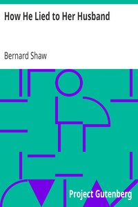

# How He Lied to Her Husband <kbd>3544</kbd>

## Authors

 - Shaw, Bernard <small>(1856 - 1950)</small>

## Subjects

 - English drama (Comedy)
 - London (England) -- Drama
 - Marriage -- Drama
 - Triangles (Interpersonal relations) -- Drama

## Download

 - https://www.gutenberg.org/cache/epub/3544/pg3544.cover.medium.jpg
 - https://www.gutenberg.org/files/3544/3544-h.zip
 - https://www.gutenberg.org/files/3544/3544-h/3544-h.htm
 - https://www.gutenberg.org/files/3544/3544.txt
 - https://www.gutenberg.org/ebooks/3544.html.images
 - https://www.gutenberg.org/ebooks/3544.kindle.images
 - https://www.gutenberg.org/ebooks/3544.epub.images
 - https://www.gutenberg.org/ebooks/3544.txt.utf-8
 - https://www.gutenberg.org/ebooks/3544.rdf

## Book Shelves

 - One Act Plays
