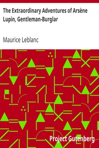

# The Extraordinary Adventures of Arsène Lupin, Gentleman-Burglar <kbd>6133</kbd>

## Authors

 - Leblanc, Maurice <small>(1864 - 1941)</small>

## Subjects

 - Adventure stories, French -- Translations into English
 - Burglars -- Fiction
 - Lupin, Arsène (Fictitious character) -- Fiction
 - Mystery and detective stories
 - Short stories

## Download

 - https://www.gutenberg.org/ebooks/6133.html.images
 - https://www.gutenberg.org/files/6133/6133-0.zip
 - https://www.gutenberg.org/files/6133/6133-h.zip
 - https://www.gutenberg.org/ebooks/6133.txt.utf-8
 - https://www.gutenberg.org/files/6133/6133-0.txt
 - https://www.gutenberg.org/cache/epub/6133/pg6133.cover.medium.jpg
 - https://www.gutenberg.org/ebooks/6133.kindle.images
 - https://www.gutenberg.org/ebooks/6133.rdf
 - https://www.gutenberg.org/ebooks/6133.epub.images

## Book Shelves

 - Crime Fiction
