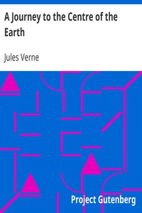

# A Journey to the Centre of the Earth <kbd>18857</kbd>

## Authors

 - Verne, Jules <small>(1828 - 1905)</small>

## Subjects

 - Adventure stories
 - Earth (Planet) -- Core -- Fiction
 - Science fiction
 - Voyages, Imaginary -- Fiction

## Download

 - https://www.gutenberg.org/files/18857/18857-h.zip
 - https://www.gutenberg.org/cache/epub/18857/pg18857.cover.small.jpg
 - https://www.gutenberg.org/files/18857/18857.zip
 - https://www.gutenberg.org/files/18857/18857-8.txt
 - https://www.gutenberg.org/files/18857/18857-h/18857-h.htm
 - https://www.gutenberg.org/ebooks/18857.html.images
 - https://www.gutenberg.org/ebooks/18857.kindle.images
 - https://www.gutenberg.org/ebooks/18857.txt.utf-8
 - https://www.gutenberg.org/ebooks/18857.epub.images
 - https://www.gutenberg.org/ebooks/18857.rdf

## Book Shelves

 - Movie Books
 - Science Fiction
