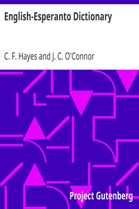

# English-Esperanto Dictionary <kbd>16967</kbd>

## Authors

 - O'Connor, J. C. (John Charles) <small>(1853 - 1928)</small>
 - Hayes, C. F. (Charles Frederic) <small>(1857 - 1942)</small>

## Subjects

 - English language -- Dictionaries -- Esperanto
 - Esperanto -- Dictionaries -- English

## Download

 - https://www.gutenberg.org/files/16967/16967-0.zip
 - https://www.gutenberg.org/cache/epub/16967/pg16967.cover.medium.jpg
 - https://www.gutenberg.org/files/16967/16967.txt
 - https://www.gutenberg.org/files/16967/16967-0.txt
 - https://www.gutenberg.org/files/16967/16967-h/16967-h.htm
 - https://www.gutenberg.org/ebooks/16967.html.images
 - https://www.gutenberg.org/files/16967/16967-8.txt
 - https://www.gutenberg.org/ebooks/16967.epub.images
 - https://www.gutenberg.org/ebooks/16967.kindle.images
 - https://www.gutenberg.org/ebooks/16967.rdf

## Book Shelves

 - Esperanto
