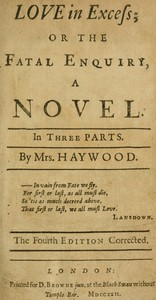

# Love in Excess; or, the Fatal Enquiry: A Novel in Three Parts <kbd>67612</kbd>

## Authors

 - Haywood, Eliza Fowler <small>(null - 1756)</small>

## Subjects

 - Aristocracy (Social class) -- Fiction
 - Bildungsromans
 - Fathers and daughters -- Fiction
 - Love stories
 - Triangles (Interpersonal relations) -- Fiction

## Download

 - https://www.gutenberg.org/cache/epub/67612/pg67612.cover.medium.jpg
 - https://www.gutenberg.org/ebooks/67612.html.images
 - https://www.gutenberg.org/files/67612/67612-h.zip
 - https://www.gutenberg.org/ebooks/67612.epub.images
 - https://www.gutenberg.org/ebooks/67612.kindle.images
 - https://www.gutenberg.org/ebooks/67612.rdf
 - https://www.gutenberg.org/ebooks/67612.txt.utf-8
 - https://www.gutenberg.org/files/67612/67612-0.txt
 - https://www.gutenberg.org/files/67612/67612-0.zip

## Book Shelves

