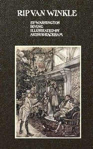

# Rip Van Winkle <kbd>60976</kbd>

## Authors

 - Irving, Washington <small>(1783 - 1859)</small>

## Subjects

 - Catskill Mountains Region (N.Y.) -- History -- 18th century -- Fiction
 - Fantasy fiction
 - Hudson River (N.Y. and N.J.) -- Fiction
 - New York (State) -- History -- 1775-1865 -- Fiction
 - Van Winkle, Rip (Fictitious character) -- Fiction

## Download

 - https://www.gutenberg.org/cache/epub/60976/pg60976.cover.small.jpg
 - https://www.gutenberg.org/files/60976/60976-0.zip
 - https://www.gutenberg.org/files/60976/60976-0.txt
 - https://www.gutenberg.org/files/60976/60976-h/60976-h.htm
 - https://www.gutenberg.org/ebooks/60976.html.images
 - https://www.gutenberg.org/ebooks/60976.epub.images
 - https://www.gutenberg.org/ebooks/60976.kindle.images
 - https://www.gutenberg.org/ebooks/60976.rdf

## Book Shelves

