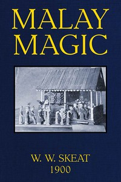

# Malay Magic: Being an introduction to the folklore and popular religion of the Malay Peninsula <kbd>47873</kbd>

## Authors

 - Skeat, Walter William <small>(1866 - 1953)</small>

## Subjects

 - Magic -- Malay Peninsula
 - Malays (Asian people) -- Folklore
 - Malays (Asian people) -- Social life and customs

## Download

 - https://www.gutenberg.org/files/47873/47873-8.zip
 - https://www.gutenberg.org/files/47873/47873-h.zip
 - https://www.gutenberg.org/cache/epub/47873/pg47873.cover.medium.jpg
 - https://www.gutenberg.org/ebooks/47873.html.images
 - https://www.gutenberg.org/ebooks/47873.epub.images
 - https://www.gutenberg.org/ebooks/47873.rdf
 - https://www.gutenberg.org/ebooks/47873.kindle.images
 - https://www.gutenberg.org/ebooks/47873.txt.utf-8

## Book Shelves

