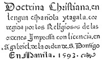

# Doctrina Christiana: The first book printed in the Philippines, Manila, 1593. <kbd>16119</kbd>

## Authors

## Subjects

 - Block books -- Facsimiles
 - Catholic Church -- Catechisms -- Spanish
 - Catholic Church -- Catechisms -- Tagalog
 - Tagalog language -- Texts

## Download

 - https://www.gutenberg.org/files/16119/16119.zip
 - https://www.gutenberg.org/files/16119/16119-h.zip
 - https://www.gutenberg.org/files/16119/16119.txt
 - https://www.gutenberg.org/cache/epub/16119/pg16119.cover.medium.jpg
 - https://www.gutenberg.org/files/16119/16119-8.txt
 - https://www.gutenberg.org/ebooks/16119.html.images
 - https://www.gutenberg.org/ebooks/16119.rdf
 - https://www.gutenberg.org/ebooks/16119.epub.images
 - https://www.gutenberg.org/ebooks/16119.kindle.images
 - https://www.gutenberg.org/ebooks/16119.txt.utf-8

## Book Shelves

 - Christianity
